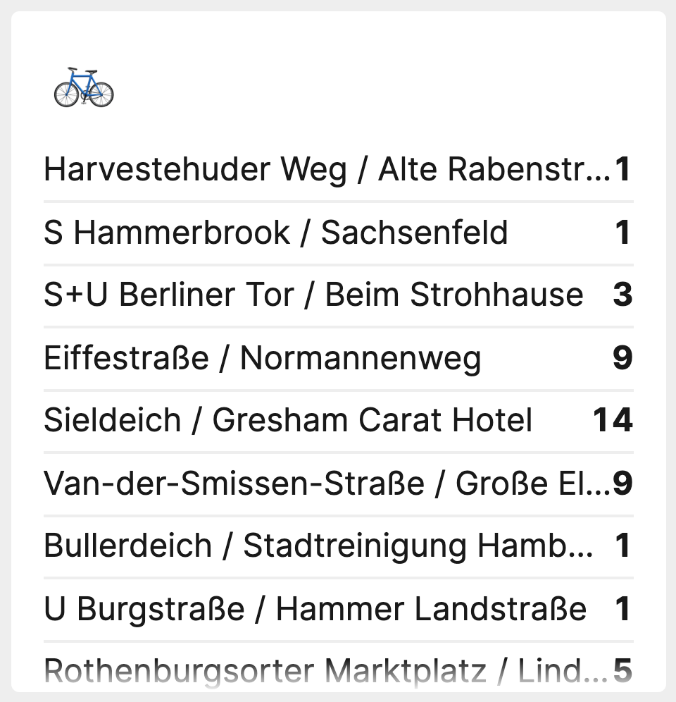

# A tile to display the status of CityBikes Stations



[](https://packagist.org/packages/astrotomic/laravel-dashboard-citybikes-tile)
[](https://github.com/Astrotomic/laravel-dashboard-citybikes-tile/blob/master/LICENSE)
[](https://plant.treeware.earth/Astrotomic/laravel-dashboard-citybikes-tile)
[](https://www.larabelles.com/)

[](https://github.com/Astrotomic/laravel-dashboard-citybikes-tile/actions?query=workflow%3Arun-tests)
[](https://styleci.io/repos/261409885)

[](https://packagist.org/packages/astrotomic/laravel-dashboard-citybikes-tile)
[](https://opencollective.com/astrotomic)

This tile can be used on the [Laravel Dashboard](https://docs.spatie.be/laravel-dashboard) to display the status of [Citybikes](https://citybik.es/) Stations - an API for bike services all over the world.

## Installation

You can install the package via composer:

```bash
composer require astrotomic/laravel-dashboard-citybikes-tile
```

In the `dashboard` config file, you must add this configuration in the `tiles` key. The `stations` should contain the IDs of the Citybikes stations that you want to display on the dashboard.

```php
// in config/dashboard.php

return [
    // ...
    'tiles' => [
        'citybikes' => [
            'network' => 'network-href', // http://api.citybik.es/v2/networks
            'stations' => [
                // IDs
            ],
            'refresh_interval_in_seconds' => 60,
        ],
    ],
];
```

In `app\Console\Kernel.php` you should schedule the `\Astrotomic\CitybikesTile\FetchCitybikesStationsCommand` to run. You can let it run every minute if you want. You could also run it less frequently if fast updates on the dashboard aren't that important for this tile.

```php
// in app/console/Kernel.php

protected function schedule(Schedule $schedule)
{
    // ...
    $schedule->command(\Astrotomic\CitybikesTile\FetchCitybikesStationsCommand::class)->everyMinute();
}
```

## Usage

In your dashboard view you use the `livewire:citybikes-tile` component.

```html
<x-dashboard>
    <livewire:citybikes-tile position="a1" />
</x-dashboard>
```

### Customizing the view

If you want to customize the view used to render this tile, run this command:

```bash
php artisan vendor:publish --provider="Astrotomic\CitybikesTile\CitybikesTileServiceProvider" --tag="dashboard-citybikes-tile-views"
```

## Testing

```bash
composer test
```

## Changelog

Please see [CHANGELOG](CHANGELOG.md) for more information on what has changed recently.

## Contributing

Please see [CONTRIBUTING](https://github.com/Astrotomic/.github/blob/master/CONTRIBUTING.md) for details. You could also be interested in [CODE OF CONDUCT](https://github.com/Astrotomic/.github/blob/master/CODE_OF_CONDUCT.md).

### Security

If you discover any security related issues, please check [SECURITY](https://github.com/Astrotomic/.github/blob/master/SECURITY.md) for steps to report it.

## Credits

-   [Tom Witkowski](https://github.com/Gummibeer)
-   [All Contributors](https://github.com/Astrotomic/laravel-dashboard-citybikes-tile/graphs/contributors)

## License

The MIT License (MIT). Please see [License](LICENSE) file for more information.

## Treeware

You're free to use this package, but if it makes it to your production environment I would highly appreciate you buying the world a tree.

It’s now common knowledge that one of the best tools to tackle the climate crisis and keep our temperatures from rising above 1.5C is to [plant trees](https://www.bbc.co.uk/news/science-environment-48870920). If you contribute to my forest you’ll be creating employment for local families and restoring wildlife habitats.

You can buy trees at [offset.earth/treeware](https://plant.treeware.earth/Astrotomic/laravel-dashboard-citybikes-tile)

Read more about Treeware at [treeware.earth](https://treeware.earth)
